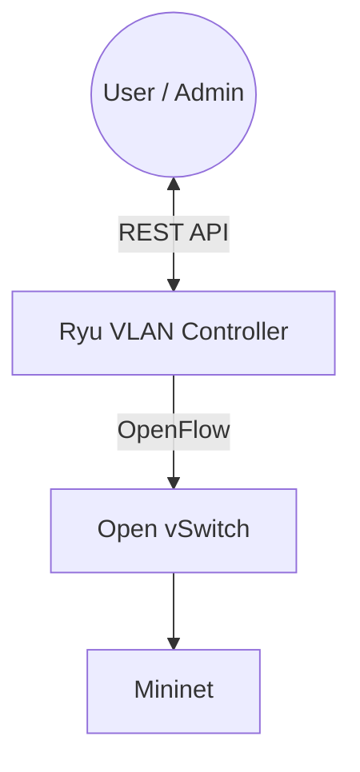
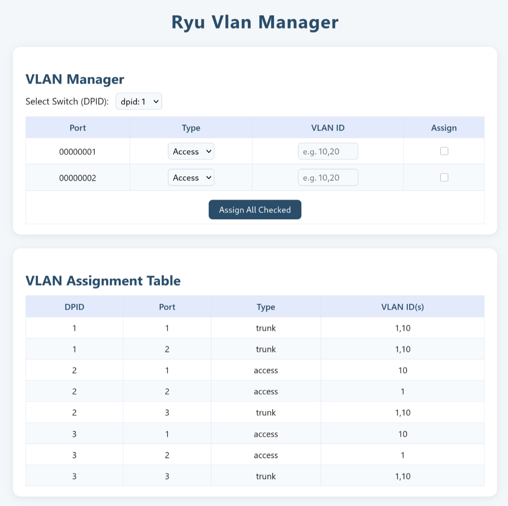

# VLAN Manager App for Ryu SDN Controller

This project implements a simple VLAN-aware SDN controller application using the [Ryu](https://osrg.github.io/ryu/) framework. It allows dynamic VLAN configuration and management of access/trunk ports via a RESTful API, designed to run on top of Mininet for simulation and testing.

---

## 📦 Features

- 🌐 **REST API** to configure VLAN assignments on access and trunk ports.
- 📶 **VLAN-based forwarding** using flow rules.
- 🔄 Dynamically updates flow tables based on API requests.
- 🧠 Built on the Ryu SDN controller and OpenFlow.
- 🧪 Tested in Mininet SDN emulator.

---

## 🛠️ Architecture



---

## 🚀 Getting Started

### Prerequisites
- Linux (tested on Ubuntu, Fedora, and Arch; works on both bare metal and virtual machines)
- Docker (with Compose v2+)

### 🐳 Running with Docker Compose

```bash
docker compose run --rm --service-ports --name ryu-vlan-manager mininet
```

> This builds and launches the Mininet container with the Ryu VLAN Manager app pre-installed and patched.

## 📁 Project Structure

```
.
├── docker-compose.yml
└── src
    ├── gui_topology
    │   ├── gui_topology.py
    │   └── html
    │       ├── host.svg
    │       ├── index.html
    │       ├── router.svg
    │       ├── ryu.topology.css
    │       └── ryu.topology.js
    └── vlan_manager.py
```

---

## ⚙️ API Endpoints

| Method | Endpoint            | Description                      |
|--------|---------------------|----------------------------------|
| POST   | `/vlan/access`      | Set access port VLAN             |
| POST   | `/vlan/trunk`       | Set trunk port with VLANs        |

---

## 🧪 Example Mininet Topology

1. Start the Mininet container:

   ```bash
   docker compose run --rm --service-ports --name ryu-vlan-manager mininet
   ```

2. Once inside the container, launch `tmux` to manage multiple terminal sessions:

   ```bash
   tmux
   ```

3. In one tmux pane, start the Ryu controller with VLAN Manager and topology GUI apps:

   ```bash
   ryu-manager --observe-links /root/src/gui_topology/gui_topology.py /root/src/vlan_manager.py
   ```

4. Open a new tmux pane (`Ctrl+b` then `%`), and run Mininet with a simple tree topology:

   ```bash
   mn --topo tree,depth=2 --controller remote --mac
   ```

5. From your host machine’s browser, access the REST API or GUI at:

   ```
   http://localhost:8080
   ```

6. Perform VLAN assignments through the REST API or GUI as needed.

<p align="center">
  
</p>

---

## 🤖 AI Assistance

Some parts of this project, including code and documentation, were developed with the assistance of AI tools such as GitHub Copilot (GPT-4.1 model) and ChatGPT (GPT-4o model). These tools were used to accelerate development, provide code suggestions, and improve documentation clarity.

---

## 📚 References

- [Ryu SDN Framework](https://osrg.github.io/ryu/)
- [OpenFlow 1.3 Spec](https://www.opennetworking.org/wp-content/uploads/2014/10/openflow-spec-v1.3.0.pdf)
- [Mininet Project](http://mininet.org/)

---

## 📝 License

[MIT License](LICENSE) – feel free to use, modify, and contribute!
